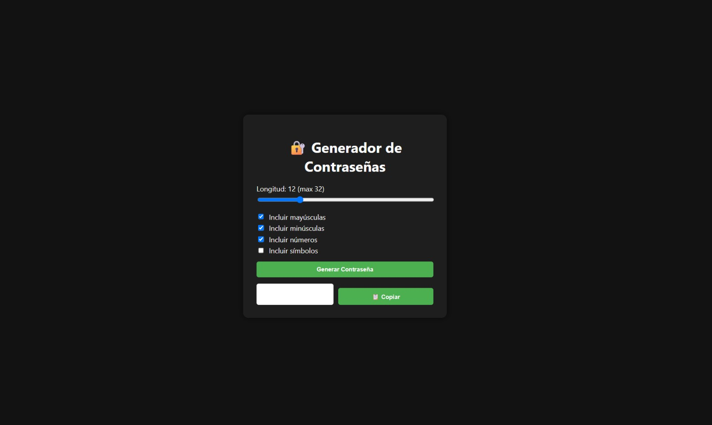

# Generador de Contraseñas Seguras 🔐

Mini app hecha con HTML, CSS y JavaScript puro para generar contraseñas aleatorias personalizadas.

## Funcionalidades

- Selección de longitud
- Inclusión de mayúsculas, números y símbolos
- Copia automática al portapapeles
- Validación básica de seguridad

## Demo

👉 [Ver online](https://password-generator-newdast.netlify.app/)

## Captura

